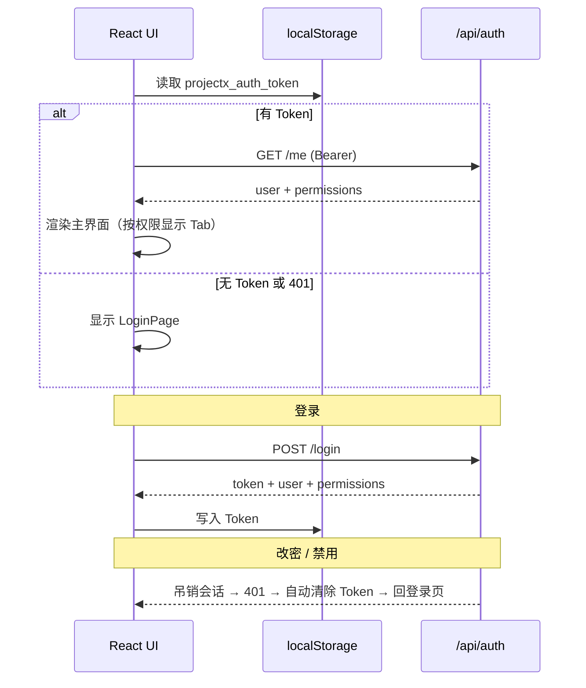

# Project-X 账号管理系统技术架构与版本说明

> **版本**: v1.5.0（历史架构快照）
> **日期**: 2026-06-17
> **关联文档**: [`ACCOUNT-CONTROL.md`](./ACCOUNT-CONTROL.md)（后端 API 详述）· [`ARCHITECTURE.md`](./ARCHITECTURE.md)（系统总览）· [`ADMIN-GUIDE.md`](./ADMIN-GUIDE.md)（管理员手册）

> ⚠️ **现状提示**：本文档为 v1.1~v1.5 时代的架构快照，其中前端文件结构（`styles.css`、模式 Tab 等）已随 v1.9.x 网页化路由与 v2.0.0 Flat 2.0 重构大幅演进，**前端结构请以 [ARCHITECTURE.md](./ARCHITECTURE.md) 与 [UI-ARCHITECTURE.md](./UI-ARCHITECTURE.md) 为准**；账号 RBAC 模型、权限矩阵与教师细分角色部分仍然有效。

本文档从**全栈视角**说明 Project-X 三级账号控制系统（RBAC）的技术架构，并对比 **v1.1 账号系统** 与 **早期 main 分支（v1.0）** 的差异。

v1.3.0 没有改变账号角色模型本身；本次主要变更在答题卡模板、题级评分规则和考试/答题卡删除保护。账号体系仍负责限制谁能进入设计、阅卷、分析和账号管理入口。

---

## 1. 架构总览

v1.1 将原先「后端半就绪、前端完全开放」的认证体系，补全为 **后端 RBAC + Electron/React 登录门禁 + 角色化 UI** 的贯通方案。

```mermaid
flowchart TB
    subgraph Electron["Electron 桌面壳"]
        BW[BrowserWindow]
    end

    subgraph Client["React 前端 client/"]
        LP[LoginPage]
        AC[AuthContext + localStorage Token]
        AM[AccountManagement]
        TM[TeacherManagement]
        SM[ClassManagement]
        SS[StudentScores]
        APP[App.tsx 角色化模式切换]
    end

    subgraph Server["Express 后端 server/"]
        MW[authMiddleware / optionalAuth / requirePermission]
        AUTH[/api/auth]
        USERS[/api/users]
        CLASSES[/api/classes]
        SCORES[/api/scores]
        GATE[业务路由 RBAC 网关]
    end

    subgraph Storage["本地存储"]
        DB[(projectx.db)]
    end

    BW --> APP
    LP --> AC
    AC -->|Bearer Token| AUTH
    AC --> UM & CM & SS & APP
    APP --> GATE
    UM --> USERS
    CM --> CLASSES
    SS --> SCORES
    AUTH & USERS & CLASSES & SCORES & GATE --> MW
    MW --> DB
```

**数据流要点：**

1. 用户打开 Electron 应用 → 前端检查 `localStorage` 中的 Token → 调用 `GET /api/auth/me` 恢复会话。
2. 未登录则展示 `LoginPage`；登录成功后 Token 写入本地，后续所有 `fetchJson` 自动附加 `Authorization: Bearer <token>`。
3. 管理员通过「账号」模式操作 `/api/users` 与 `/api/classes`；学生通过「我的成绩」访问 `/api/scores/me`。
4. 业务接口（答题卡、考试、阅卷、分析）在 `PROJECTX_AUTH_ENFORCE=1` 时经 RBAC 网关拦截；管理类接口**始终强制鉴权**。

---

## 2. 后端架构（共享服务层）

后端实现详见 [`ACCOUNT-CONTROL.md`](./ACCOUNT-CONTROL.md)，此处概括核心分层。

| 层级 | 路径 | 职责 |
|------|------|------|
| **权限模型** | `src/server/auth/permissions.ts` | 权限常量、`域:动作` 命名、通配符 `*` / `card:*`、角色权限缓存 |
| **认证服务** | `src/server/services/AuthService.ts` | 登录、登出、改密、Token 签发与吊销（内存 Map，8 小时有效） |
| **中间件** | `src/server/middleware/auth.ts` | `authMiddleware`、`optionalAuth`、`requireRole`、`requirePermission` |
| **数据访问** | `UserRepository` / `ClassRepository` / `ScoreRepository` | 用户、组织结构、成绩查询 |
| **路由** | `routes/auth.ts` · `users.ts` · `classes.ts` · `scores.ts` | REST API |
| **网关** | `apps/answer-card/server/index.ts` | 业务路由读写权限守卫；`optionalAuth` 记录 `created_by` |

### 2.1 三级角色与权限

| 角色 | 权限标识 | 能力摘要 |
|------|----------|----------|
| **admin** | `["*"]` | 全部功能 + 用户/班级管理 |
| **teacher** | `card:*` `exam:*` `grade:*`（读写） | 答题卡、考试、阅卷、分析；可读班级列表 |
| **student** | `score:read` | 仅查自己的考试成绩 |

### 2.2 渐进启用开关

| `PROJECTX_AUTH_ENFORCE` | 行为 |
|-------------------------|------|
| 未设置 / `0`（默认） | 业务路由不拦截；管理类 API 仍强制登录 |
| `1` / `true` | 业务路由未登录 401、权限不足 403 |

前端 v1.1 已默认要求登录，与强制鉴权开关配合使用时可实现完整三级控制。

---

## 3. 前端 / Electron UI 架构（v1.1 新增）

### 3.1 目录结构

```
src/apps/answer-card/client/
├── auth/
│   ├── api.ts           # fetchJson / authFetch / urlWithToken / 401 自动登出
│   ├── AuthContext.tsx  # 全局认证状态、hasPermission、角色判断
│   └── types.ts         # 前后端 DTO、权限常量、permissionGrants()
├── components/
│   ├── LoginPage.tsx           # 登录页
│   ├── AccountMenu.tsx         # 右上角用户菜单（改密、退出）
│   ├── AccountManagement.tsx   # 管理员双 Tab 容器
│   ├── TeacherManagement.tsx   # 教师管理（科目/班级关联）
│   ├── ClassManagement.tsx     # 学生管理（年级/班级/花名册，原名班级管理）
│   └── StudentScores.tsx       # 学生自助查分
├── App.tsx              # 主壳：登录门禁 + 角色化模式 Tab
├── main.tsx             # AuthProvider 包裹根组件
└── styles.css           # 登录页、账号管理、成绩卡片样式
```

### 3.2 认证状态管理



**关键实现：**

- Token 键名：`projectx_auth_token`，存于 `localStorage`，Electron 重启后仍可恢复会话（直至 8 小时过期或服务重启）。
- `fetchJson` 统一注入 `Authorization` 头；解析服务端 `{ message }` 错误体。
- `urlWithToken()` 为 PDF 下载、坐标 JSON、扫描仪 SSE、扫描图片等**无法设请求头**的场景追加 `?token=`（与后端中间件兼容）。
- 收到 401（除登录接口外）时触发 `projectx:unauthorized` 事件，自动清除本地 Token 并回到登录页。

### 3.3 工作模式与权限映射

`App.tsx` 在 v1.0 三种模式基础上扩展为五种，**按权限动态显示**：

| 模式 | 显示条件 | 主要组件 |
|------|----------|----------|
| **设计** | `card:read` | 答题卡编辑器、预览、PDF 导出 |
| **阅卷** | `grade:read` | 图片上传、扫描仪、判分结果 |
| **分析** | `exam:read` | 成绩统计、排名、题目分析；子 Tab「考试管理」需 `exam:write` |
| **我的成绩** | 学生角色 + `score:read` | `StudentScores` |
| **账号** | `user:manage` | `AccountManagement`（教师管理 + 学生管理） |

**布局差异：**

- 教师/管理员：左侧答题卡列表 + 右侧工作区。
- 学生：无左侧栏（`no-card-sidebar`），全宽展示「我的成绩」。

### 3.4 与 Electron 的集成方式

Electron 主进程（`electron/main.cjs`）启动内嵌 Express 服务并加载 `dist/client` 静态资源。账号 UI **不修改 Electron 主进程**——认证完全在前端 SPA 层完成，通过同源 HTTP 调用本地 API。

生产环境数据目录：`%AppData%/.../userData/data/projectx.db`（用户与成绩数据与桌面安装位置无关，便于机房统一部署）。

---

## 4. v1.1 账号系统 vs 早期 main（v1.0）对比

早期 main 分支对应 README 标注的 **v1.0.0**：答题卡设计 → 阅卷 → 分析全流程可用，但**产品层未启用账号体系**。

### 4.1 功能对比

| 维度 | 早期 main（v1.0） | 账号系统（v1.1 起） |
|------|-------------------|------------------|
| **启动体验** | 打开即用，无需登录 | 必须先登录；会话过期自动回登录页 |
| **前端模式** | 设计 / 阅卷 / 分析（人人相同） | 按角色显示不同 Tab；学生仅「我的成绩」 |
| **用户管理 UI** | 无 | 管理员「账号」页：增删改查、批量导入、重置密码 |
| **班级管理 UI** | 无 | 年级 → 班级 → 花名册三栏管理 |
| **学生查分 UI** | 无 | 学生登录后查看各场考试得分、排名、逐题明细 |
| **改密** | 无 UI（仅有后端潜力） | 右上角用户菜单自助改密 |
| **API 鉴权** | 业务接口完全开放 | 管理 API 强制鉴权；业务 API 可选 `PROJECTX_AUTH_ENFORCE` |
| **Token 传递** | 前端不传 Token | 全站 `fetchJson` + PDF/SSE `?token=` |
| **班级筛选分析** | 分析页可读班级（若后端有数据） | 同上，且班级需管理员先建班编班 |
| **自动化验证** | 无 | `npm run verify:auth`（33 项用例） |

### 4.2 代码变更范围

**v1.0 → v1.1 后端新增/修改**（见 `ACCOUNT-CONTROL.md` 第 2 节）：

- 新增：`permissions.ts`、`ClassRepository`、`ScoreRepository`、`routes/users|classes|scores`、`verify-auth.ts`
- 修改：`AuthService`、`UserRepository`、`middleware/auth`、`routes/auth`、`server/index.ts`

**v1.1.0 新增多端变体**：

| 变体 | ID | 默认首页 | 允许模式 | 原生资源 |
|------|------|------|------|------|
| 学生端 | `student` | 我的成绩 | `scores` | 无 |
| 教师普通端 | `teacher` | 设计 | design/grading/analysis/account | 识别引擎 |
| 教师扫描端 | `teacher-scanner` | 阅卷 | design/grading/analysis/account | 全部（识别+扫描） |

- 三端共用 `%APPDATA%\answer-card-designer` 数据目录
- 变体配置：`src/shared/appVariant.ts`（v1.6.1 起由 `VITE_BUILD_TARGET` 替代编译时变体）
- 扫描端打包：`npm run electron:dist` / `electron:msi`（仅扫描端，x64/ia32）
- 学生端既限产品功能（只能看我的成绩），也限账号角色权限
- 新增：`passwordPolicy.ts`（学生默认密码允许5位学号）

**v1.1 前端新增**（相对 v1.0 的 `client/`）：

| 新增文件 | 说明 |
|----------|------|
| `auth/api.ts` | 鉴权 HTTP 封装 |
| `auth/AuthContext.tsx` | React Context |
| `auth/types.ts` | 类型与权限工具 |
| `components/LoginPage.tsx` | 登录页 |
| `components/AccountMenu.tsx` | 用户菜单 |
| `components/AccountManagement.tsx` | 账号管理容器 |
| `components/TeacherManagement.tsx` | 教师管理 |
| `components/ClassManagement.tsx` | 学生管理（原班级管理改名） |
| `components/StudentScores.tsx` | 学生成绩 |

| 修改文件 | 说明 |
|----------|------|
| `App.tsx` | 登录门禁、五种模式、权限 Tab、`urlWithToken` 链接 |
| `main.tsx` | 挂载 `AuthProvider` |
| `styles.css` | 账号/登录/成绩样式 |
| `ScannerPanel.tsx` | 扫描 API 与 SSE 鉴权 |

### 4.3 数据库与部署

| 项目 | v1.0 | v1.1 |
|------|------|------|
| **Schema 迁移** | — | **无需迁移**，复用已有 `users/roles/grades/classes/...` 表 |
| **默认账号** | 库中有 admin，但 UI 不强制使用 | 首次登录 `admin` + 数据库同目录的一次性引导密码，系统强制立即改密 |
| **向后兼容** | — | `PROJECTX_AUTH_ENFORCE=0` 时旧版「无 Token 调业务 API」仍可工作（管理 API 除外） |

### 4.4 架构演进示意

```
v1.0 main
  Electron → React（三模式，无登录）→ Express（业务 API 开放）
                    ↘ Auth 骨架存在但未贯通

v1.1 当前
  Electron → React（登录 + 角色化 UI）→ Express（RBAC + 管理 API）
                    ↘ Token 全链路 · 可选业务强制鉴权
```

---

## 5. 安全与设计取舍

| 议题 | 当前方案 | 说明 |
|------|----------|------|
| Token 存储 | 磁盘文件 `~/.projectx/tokens.json` | 服务器重启后 Token 存活（持久化 6 个月） |
| 前端 Token | `localStorage` | 桌面单机场景可接受；改密/禁用时服务端吊销 |
| 密码 | bcryptjs 哈希（bcrypt 格式兼容） | 默认学生密码=学号，管理员应督促首次登录改密 |
| 管理员保护 | 至少保留 1 名 admin | 后端拒绝降级/禁用最后一名管理员 |
| 排名计算 | 查询时即时计算 | 不依赖 `student_scores.rank` 是否落库 |

---

## 6. 验证与构建

```powershell
npm install
npm run typecheck      # TypeScript 严格模式
npm run verify:auth    # 后端 RBAC 端到端（临时库，33 项）
npm run build
npm run electron:dev   # 桌面应用联调
npm run electron:msi:all # 生成三端 x64/ia32 共 6 个 MSI
```

启用完整业务鉴权：

```powershell
$env:PROJECTX_AUTH_ENFORCE = "1"
npm run electron:dev
```

---

## 7. 文档索引

| 文档 | 读者 | 内容 |
|------|------|------|
| **本文** | 开发者 | 全栈架构 + v1.0/v1.1 对比 |
| [`ACCOUNT-CONTROL.md`](./ACCOUNT-CONTROL.md) | 开发者 | 后端 API、权限模型、接口清单 |
| [`ADMIN-GUIDE.md`](./ADMIN-GUIDE.md) | 学校管理员 | 操作步骤与日常流程 |
| [`ARCHITECTURE.md`](./ARCHITECTURE.md) | 开发者 | 答题卡系统总体架构 |
| [`DATABASE.md`](./DATABASE.md) | 开发者 | 数据库表结构 |

---

_由五中人，为五中人，服务五中教学。_
