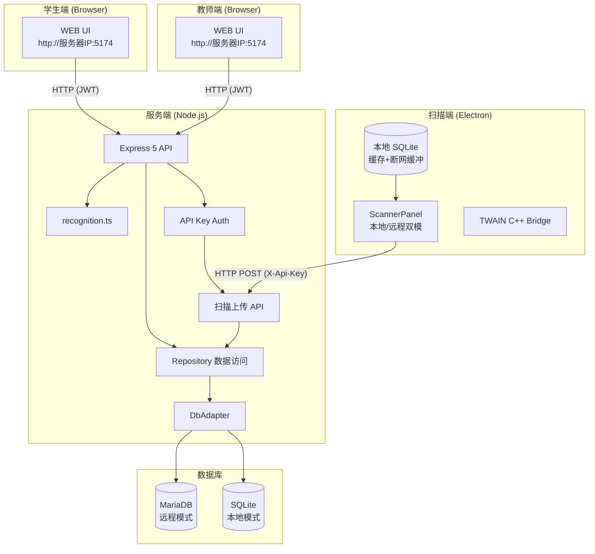
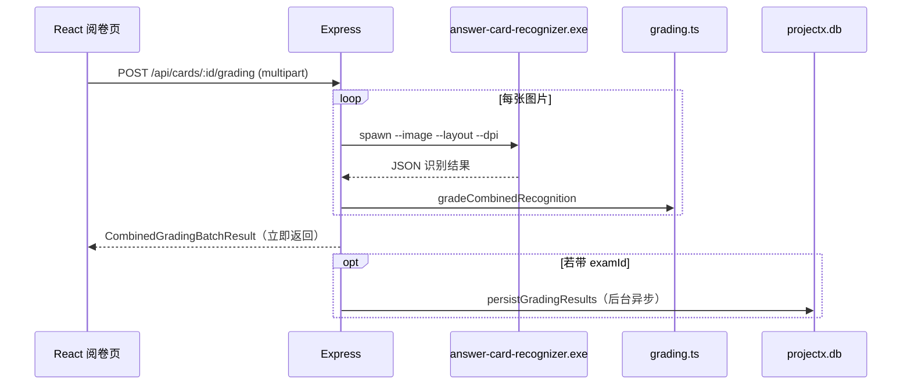
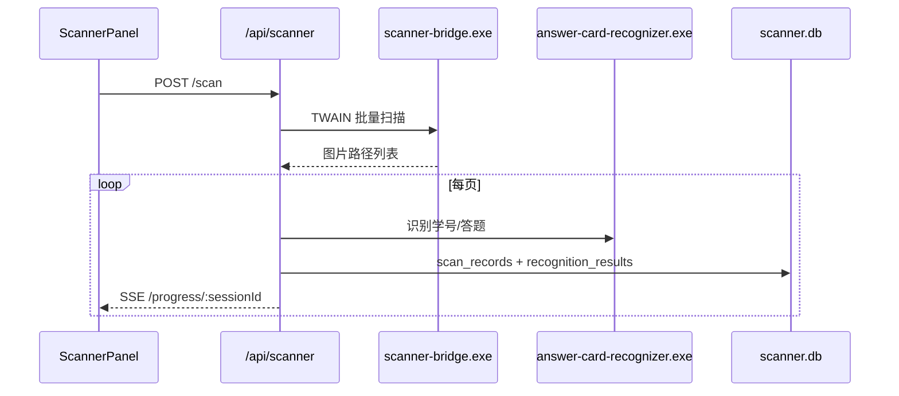
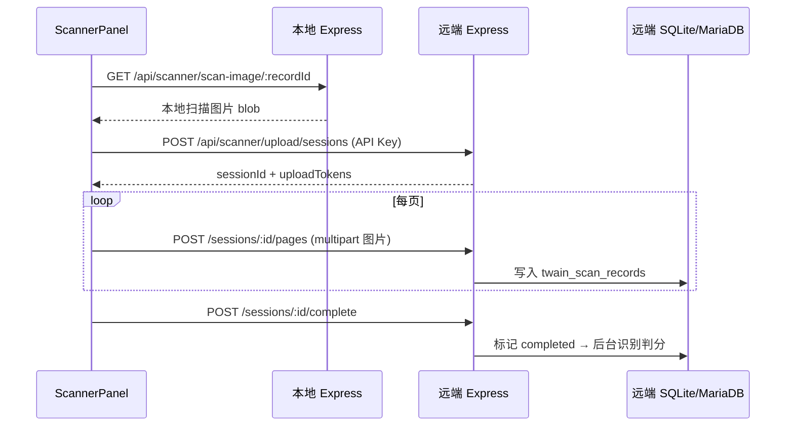
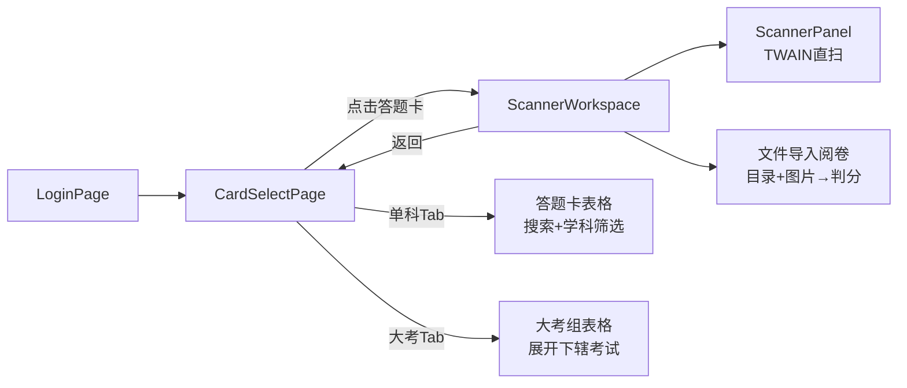
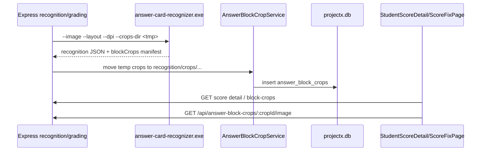
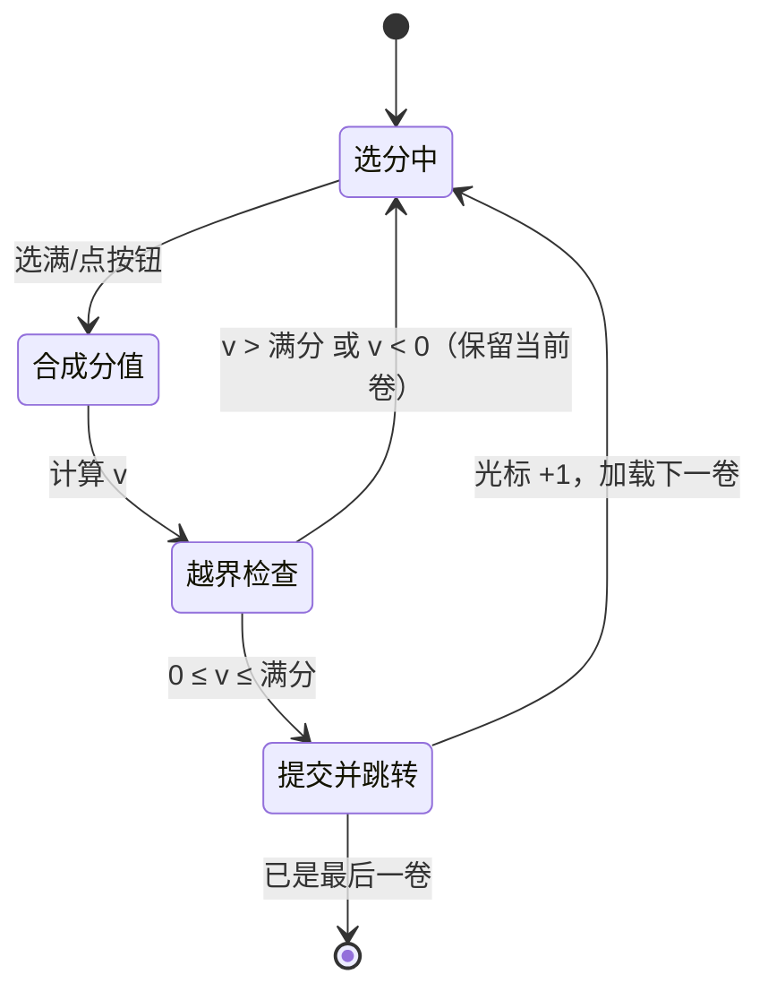
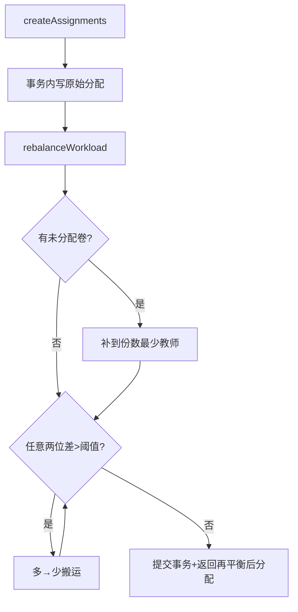
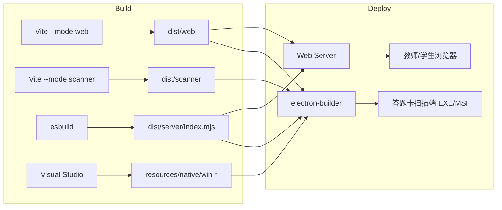

# Project-X 架构分析

**Project-X（答题卡设计阅卷系统）** 是大连五中自研的智能试卷管理工具，覆盖 **答题卡设计 → PDF 导出 → 扫描/上传识别 → 自动判分 → 网上阅卷（2P/3P 多评 + 争议仲裁）→ 成绩分析 → AI 成绩分析** 全流程。架构上支持 **本地 SQLite 单机模式** 和 **远程 MariaDB 服务器模式**，通过统一的 `DbAdapter` 接口无缝切换。

> **v1.9.2** 网页化改造 / 启动台模式：
> - **URL 路由化 → 真实 `<Routes>`**：`createBrowserRouter` + `react-router-dom v7` 每功能独立 URL；阶段 2 续由「`mode` + CSS `hidden-panel` 全挂载」升级为由 URL 真实驱动渲染（含 `/home` `/design` `/exam-manage` `/grading` `/analysis` `/scores` `/account` `/sponsor` `/permissions` `/guide`）
> - **启动台模式**：Home 模块卡支持 `在新窗口打开`，子页面顶部有 `← 返回首页` 按钮
> - **前端组件解耦**：`App.tsx` 巨石拆为 `cardModel.ts`（设计 helper）+ `pages/DesignEditors.tsx`（编辑器/SVG）+ `pages/*`（Design/ExamManage/Grading 页面）；`WorkspaceProvider` 全量下发包级共享状态（`useWorkspace()`），App 由 ~3700 行降为 ~2290 行
> - **设计令牌 + 组件库**：`theme.ts` TS 令牌镜像 + `components/ui/*` 共享组件库（Button/Modal/SegmentedControl/Input/Panel/Table/Spinner/LoadingScreen）
> - **设计风格统一**：`styles.css` 新增 `--success`/`--warning`/`--info` 语义色 + `--z-*` z-index 阶梯，硬编码色全部收敛
> - **异步安全**：`asyncHandler.ts` + `wrapRouter` 全局包裹 async 处理器，防请求挂死
> - **新增路由**：赋分公式 `GET/PUT /api/exams/:examId/assigned-formula`、express-rate-limit 登录限速
>
> **v1.9.0** 网阅系统全面重构：
> - **Home 仪表盘**：登录后进入图形化首页，模块卡片 + 快捷入口
> - **考试管理**：阅卷中黄底置顶，考试详情 5 Tab（阅卷/分配/争议/溯源/设置）
> - **网阅**：嵌入考试管理，2P/3P 多评 + 争议仲裁 + PAD 优先 UI + 断点续批
> - 移除独立 `grading` 模式，新增 `home` 模式

> **v1.9.4** 网阅打分面板与工作量均衡增强（详见 §6.6）：
> - 打分面板按满分阈值自动切换「枚举模式（<20）/ 位值模式（≥20）」，含 0.5 小数与自动跳转
> - 仲裁人可选；未设仲裁人时按阈值自动再分配剩余卷与争议卷
> - 设置三层拆分：个性化（不变）/ 局部网阅（考试「网阅设置」Tab，含「网阅默认」模板）/ 全局（仅管理员，原卷策略 + AI 系统配置）

技术栈：**Electron 桌面壳（扫描端）+ Express 后端 + React 前端 + C++ 原生子进程 + Python LLM 中转服务**。

---

## 1. 总体架构

### v1.6.0+ 客户端拆分架构



> 兼容模式（本地运行）：Electron 内同时运行 ScannerPanel + Express Server，数据全在本地。配置详见 [DATABASE.md](./DATABASE.md)。

    subgraph Native["C++ 原生层"]
        OCR[answer-card-recognizer.exe<br/>OpenCV 识别]
        TWAIN[scanner-bridge.exe<br/>TWAIN 扫描]
    end

    subgraph Storage["本地存储"]
        DB1[(projectx.db<br/>用户/考试/成绩)]
        DB2[(scanner.db<br/>扫描会话)]
        FS[data/answer-card/<br/>JSON/图片/布局]
    end

    EM -->|动态端口| EX
    BW -->|HTTP| EX
    EX --> REPO
    EX --> REC
    EX --> SCN
    EX --> PDF
    EX --> Shared
    REC -->|spawn JSON stdout| OCR
    SCN -->|spawn| TWAIN
    REPO --> DB1
    SCN --> DB2
    EX --> FS
    OCR -->|读 layout JSON| FS
```

**运行模式对比：**

| 模式 | 前端 | 后端 | 数据目录 |
|------|------|------|----------|
| 开发 `npm run dev` | Vite :5173（代理 `/api`） | tsx :5174 | 项目根 `data/` |
| Web 部署 | `dist/web` 静态资源 | `dist/server/index.mjs` | `data/` 或自定义 |
| Electron 扫描端 | `dist/scanner` 静态资源 | `dist/server/index.mjs` | `%AppData%/answer-card-designer/` |

Electron 主进程通过环境变量注入路径：

```javascript
// electron/main.cjs — v1.6.1: Scanner only
async function startLocalServer() {
  const serverBundle = path.join(appRoot, "dist", "server", "index.mjs");
  const clientDist = path.join(appRoot, "dist", "scanner");

  process.env.PROJECTX_ENABLE_SCANNER = "1";
  process.env.ANSWER_CARD_CLIENT_DIST = clientDist;
  // ...
}
```

---

## 2. 源码分层

```
src/
├── apps/answer-card/     ← 当前唯一业务应用（答题卡）
│   ├── client/           ← React UI（设计 / 阅卷 / 分析）
│   └── server/           ← Express 路由 + 识别/PDF/扫描
├── server/               ← 跨应用共享后端（DB、Repository、Auth）
└── shared/               ← 前后端共享领域逻辑（类型、布局、判分）
native/                   ← C++ 识别引擎 + TWAIN 桥
electron/                 ← 桌面打包入口
```

这是 **按应用划分 + 共享内核** 的结构：`apps/answer-card` 是具体产品，`server/` 和 `shared/` 为后续扩展（如 v1.1 权限、多班级）预留。

---

## 3. 前端架构

### 3.1 路由与工作模式（v1.9.2+）

v1.9.2 从传统 `useState` 状态切换升级为 **URL 路由化**，使用 `react-router-dom v7` 的 `createBrowserRouter`；后期（阶段 2 续 C）由「`mode` 状态 + CSS `hidden-panel` 全挂载切换」进一步改为由 URL **真实驱动渲染**（`App.tsx` 内 `<Routes>` 路由表）：

- **`main.tsx`**：创建 `RouterProvider`，加载 `modeRoutes.ts` 定义的路由表
- **`modeRoutes.ts`**：定义 URL 与工作模式的映射（`MODE_PATH`），含 `home / design / exam-manage / grading / analysis / scores / account / sponsor / permissions / guide`；`pathToMode()` 用于深链还原
- **真实 `<Routes>`**：`App.tsx` 用 `<Routes>` 按当前路径渲染对应页面，`*` → `<Navigate to="/home" />`；`gradingPanel` 浮层与 statusbar 保持在 `<Routes>` 之外。`mode` 状态由登录初始化 effect 与 URL 实时同步，顶栏 `NavLink` 高亮、标题、`showCardSidebar`、`useBlocker` 均自动正确
- **深链支持**：页面刷新/新标签打开时 **尊重地址栏 URL**，而非无条件打回首页
- **`useBlocker`**：答题卡有未保存修改时拦截离开 `/design` 的导航，弹出确认对话框
- **启动台模式**：Home 页模块卡提供 `在新窗口打开` 能力（新前台标签打开功能 URL，首页保留为常驻启动台），子页面顶部仅在紧凑模式（`!showTabBar`）时显示 `← 返回首页` 按钮

### 3.2 页面组件抽取与状态外置（v1.9.2+）

大型组件从 `App.tsx` 内联 JSX 抽取为独立 page 组件，并通过 `WorkspaceContext` 消费共享状态，实现「拆而不改行为」的渐进重构：

**模块拆分（按依赖方向解环）：**

| 模块 | 文件 | 职责 |
|------|------|------|
| **设计领域模型** | `client/cardModel.ts` | 20+ 设计 helper（`modeLabels`/`defaultObjective`/`defaultSubjective`/`subjectiveBlockKindLabel`/`answerLineCount` 等）+ `PreviewMode`/`PREVIEW_*` 预览设置常量，从 `App.tsx` 收编 |
| **设计编辑器** | `client/pages/DesignEditors.tsx` | `ObjectiveEditor` / `SubjectiveEditor` / `CardPreview` / `StudentAreaSvg` / `ObjectiveSvg` / `SubjectiveSvg`，从 `App.tsx` 抽出 |
| **DesignPage** | `pages/DesignPage.tsx` | 答题卡设计 / 编辑（改 `useWorkspace()` 消费，直接从 `./DesignEditors` 导入编辑器） |
| **ExamManagePage** | `pages/ExamManagePage.tsx` | 考试管理 / 阅卷 / 大考组（改 `useWorkspace()` 消费） |
| **GradingPage** | `pages/GradingPage.tsx` | 上传图片、批量识别判分（保留 props 范式，未切 `useWorkspace()`） |

**状态外置：** `WorkspaceContext.tsx` 定义完整 `WorkspaceValue` 值对象（~119 字段）。`App.tsx` 构造 `workspace` 并用 `<WorkspaceProvider value={workspace}>` 包裹整个 `<main>` 壳层；`DesignPage` / `ExamManagePage` 通过 `useWorkspace()` 读取共享状态（`teacherId`/`teacherRole`/`userRole` 由 `user` 派生），不再逐层 props 透传。`GradingPage` 因交互形态差异，仍按计划以 props 接收（函数引用不变 → 行为一致）。

> 设计意义：`App.tsx` 体积由 ~3700 行降为 ~2290 行，仅保留状态与 handlers；共享依赖集中在 `cardModel.ts` / `DesignEditors.tsx`，消除 `App.tsx` 与页面之间的循环引用风险。

### 3.3 设计令牌与 UI 组件库（v1.9.2+）

- **`theme.ts`**：将 `styles.css` 的 CSS 自定义属性镜像为 TS 对象，供 JS 侧图表/状态点引用
- **`components/ui/`**：共享 UI 组件库（Button / Modal / SegmentedControl / Input / Panel / Table / Spinner / LoadingScreen），封装 5 种模态实现 + 4 套分段控件 + 裸 `<table>` 等不一致
- **语义色**：`styles.css` 新增 `--success:#2E7D32; --warning:#E65100; --info:#1565C0`，组件中硬编码 `#2E7D32` 全部替换为 `var(--success)`
- **z-index 阶梯**：`--z-dropdown:900` / `--z-modal:1000` / `--z-toast:1100` / `--z-lightbox:1200`

### 3.4 工作模式一览

| 模式 | 路径 | 职责 | 主要组件 |
|------|------|------|----------|
| **home** | `/home` | 启动台仪表盘，模块卡可新标签打开 | `HomePage` |
| **design** | `/design/*` | 编辑答题卡、预览、导出 PDF | `DesignPage` + `DesignEditors`(`CardPreview`/`ObjectiveEditor`/`SubjectiveEditor`) + `buildLayout` 预览 |
| **exam-manage** | `/exam-manage` | 考试管理 / 阅卷分配 / 大考组 | `ExamManagePage` |
| **grading** | `/grading` | 上传图片、批量识别判分 | `GradingPage` + `GradingResults`、`ScanPreviewModal`（UI 由 `GradePanel` 弹层承载） |
| **analysis** | `/analysis` | 考试统计、排名、题目分析 | `ExamSelectPage` / `ExamGroupDetailPage` / `ScoreDetailPage` |
| **scores** | `/scores` | 学生查看个人成绩 | `StudentScores` |
| **account** | `/account` | 教师/学生管理 | `AccountManagement`、`TeacherManagement`、`ClassManagement` |
| **sponsor** | `/sponsor` | 赞助页 | `SponsorPage` |
| **permissions** | `/permissions` | 权限管理 | `PermissionManager` |
| **guide** | `/guide` | 使用指南 | `UserGuidePage` |

**特点：**

- 无 Redux/Zustand，用 React `useState` + `WorkspaceContext`（`useWorkspace()`）+ `fetch` 直连 REST API
- 路由由 URL 真实驱动（`<Routes>`），非 `hidden-panel` 全挂载切换；切走即卸载，回来看重（设计页编辑态、考试管理选择态在 workspace 中保留）
- 图标：`lucide-react`
- 样式：单一 `styles.css` + `theme.ts` 设计令牌，无 UI 框架
- 与后端通信：`fetchJson` 封装，开发时 Vite 代理到 5174

---

## 4. 后端架构

### 4.1 Express 单体路由

入口 `src/apps/answer-card/server/index.ts` 的 `createApp()` 负责：

1. 初始化 `projectx.db`、默认管理员、定时清理
2. 挂载 REST 路由
3. 生产环境托管 `dist/web`（SPA fallback）

**API 域划分：**

| 前缀 | 功能 |
|------|------|
| `/api/auth` | 登录 / 登出 / 当前用户 |
| `/api/cards` | 答题卡 CRUD、布局、PDF、识别、判分 |
| `/api/exams` | 考试管理 |
| `/api/analysis` | 成绩统计、排名、AI 分析转发 |
| `/api/app/health` | Electron 本地服务健康检查 |
| `/api/scanner` | TWAIN 扫描会话（SSE 进度） |
| `/assets` | 答题卡资源图片 |

### 4.2 AI 成绩分析链路

v1.2.0 新增 AI 成绩分析，但模型调用不直接放在 Electron 主进程里。链路为：

```text
React AnalysisAiPanel
  -> Express /api/analysis/ai/status
  -> Express /api/analysis/exams/:examId/ai-analysis
  -> llmclient FastAPI /analysis/run
  -> Gemini / DeepSeek / OpenAI-compatible provider
```

`llmclient` 位于仓库根目录，使用 Python `FastAPI + uvicorn`。Node 后端在启动时会**自动拉起**该服务（默认 `http://127.0.0.1:8766`，见 `src/apps/answer-card/server/llm-launcher.ts`），也可手动启动；也可通过 `LLMCLIENT_AUTOSTART=false` 关闭、`LLMCLIENT_PYTHON` 指定解释器、`LLMCLIENT_URL` 指定地址端口。Node 后端只负责探活、鉴权转发和把当前考试/班级范围传给 Python 服务（AI 调用前会 `ensureLlmClient()` 确保侧车已起，未起则自动拉起）。模型只能调用白名单成绩工具读取 `projectx.db`，不开放原始 SQL。

#### 4.2.1 成绩分析模块（难度 P / 区分度 D / 总体分析）

成绩分析在 v1.10.0 重构为「双 6-Tab」结构，普通考试（`ScoreDetailPage`）与大考（`ExamGroupDetailPage`）均为：**概况 / 成绩 / 题目分析 / 班级对比 / 总体分析 / AI 分析**；大考的「成绩 / 题目分析 / 班级对比」支持「合并 ↔ 分科」视图切换（`SubjectViewMode`）。「班级对比」与「题目分析」共存，不互相替代。

- **难度系数 P 与区分度 D**：P = 平均分 / 满分；D 采用极端组法（按总分降序取高/低各 27% 学生，D = 高分组得分率 − 低分组得分率），在考试 / 大考 / 科目 / 题目四级统一产出。`AnalysisRepository` 通过 `discriminationByExtremeGroup`（`src/shared/stats.ts`）计算，分布结果 `DistributionResult` 新增 `qq`（Q-Q 图坐标）。
- **题目分析**：表头可点击排序（题号/类型/得分率/正确率/平均分/满分/错误率/P/D），点击行打开 `QuestionStudentScoresModal` 下钻查看该题**每个学生的得分明细**（学号/姓名/班级/得分率/知识点），大考下钻复用 per-exam 的 `/api/analysis/exams/:examId/question-students` 端点。难度/区分度以 `DifficultyBadge` / `DiscriminationBadge` 彩色档位徽章呈现。
- **总体分析**：整合自 `score_distribution_viewer.html` 的分布可视化——直方图（叠加正态曲线）+ Q-Q 图 + 正态性检验（Shapiro-Wilk / KS / AD / 偏度 / 峰度）；普通考试按全卷与各班、大考按总分 / 各科 / 各班切换；样本量 < 30 给出小样本提示。组件 `AnalysisOverall` 普通考试与大考共用。
- **档位阈值**：管理员在 Home「全局设置」配置难度 / 区分度档位（阈值、标签、颜色），持久化于 `system_settings.analysis_difficulty_bands` / `analysis_discrimination_bands`；前端通过 `useBands()` 钩子读取，徽章与统计统一口径。
- **大考 AI 分析**：`/api/exam-groups/:groupId/ai-analysis` 转发时只传 `groupId`（不传 `examId`），Node 把请求转给 `llmclient /analysis/run`，由 Python 侧 `get_group_exam_ids` 解析成员考试集合并下传工具层；模型按成员考试逐科调用工具汇总。`AnalysisAiPanel` 通过 `groupId` 或 `examId` 自动选择端点。

### 4.3 Repository 模式

`src/server/repositories/` 封装 SQLite 访问：

- `CardRepository` — 答题卡及题块元数据
- `ExamRepository` — 考试、扫描批次、成绩落库
- `AnalysisRepository` — 聚合统计查询
- `UserRepository` — 用户与角色

数据库入口在 `src/server/db/`：`index.ts` 负责连接与初始化编排，`paths.ts` 统一解析 `projectx.db`、`data/answer-card/` 和 legacy `scanner.db` 路径，`migrations.ts` 通过 `schema_migrations` 记录版本化幂等迁移。底层继续使用 **better-sqlite3 同步 API + WAL + 外键**。

### 4.4 双数据库设计

| 数据库 | 路径 | 用途 |
|--------|------|------|
| **projectx.db** | `PROJECTX_DB_PATH` | 用户、角色、答题卡、考试、成绩、班级 |
| **scanner.db** | `data/answer-card/scanner.db` | legacy 扫描会话缓存；文件不存在时视为正常 |

扫描子系统独立库，与主库解耦，便于扫描流水单独保留/清理（主库 schema 注释：扫描原始数据保留 30 天）。

### 4.5 文件存储层

`storage.ts` 定义运行时文件布局：

```
data/answer-card/
├── cards/          # 答题卡 JSON（历史/兼容，主数据已进 DB）
├── layouts/        # LayoutDocument JSON（供 C++ 识别引擎读取）
├── assets/         # 主观题插图等资源
├── scans/          # 扫描仪直扫图片
├── recognition/    # 阅卷上传的临时图片
└── scanner.db
```

答题卡结构保存到 SQLite 的结构化表；`layouts/` 下的 LayoutDocument JSON 是按需由 `buildLayout(card)` 生成的派生产物，识别引擎只读取最新生成的布局文件路径。

---

## 5. 共享领域层（核心设计）

`src/shared/` 是前后端共用的 **领域模型与算法**，避免判分/布局逻辑重复。

### 5.1 类型系统 (`types.ts`)

定义完整领域模型：

- `AnswerCard` / `BodyBlock`（客观题、主观题）
- `ObjectiveQuestionConfig` / `ObjectiveScoringRule`（题级题型、选项数、分值、部分得分规则）
- `SubjectiveBlockKind` / `BlankItem`（填空题块、解答题块、逐空尺寸与标签）
- `LayoutDocument`（毫米级坐标）
- 识别结果、判分结果、分析统计等 DTO

### 5.2 布局引擎 (`layout.ts`)

纯函数 `buildLayout(card)`：

- A4 210×297mm 坐标系
- 六点定位标记、学号填涂格、客观选项框、主观书写区
- 密度档位（loose/normal/compact/dense）
- 支持非连续客观题号、同一题块内混合选项数/分值、填空题多列紧凑排版
- 输出供 **PDF 渲染** 和 **C++ 识别** 共用

### 5.3 判分引擎 (`grading.ts`)

TypeScript 实现，在 Node 侧运行：

- `objectiveQuestionDefinitions` — 将旧题块字段和 v1.3 题级配置归一化为逐题定义
- `gradeObjectiveRecognition` — 客观题对比标准答案（单选/多选/不定项、部分分）
- `ObjectiveScoringRule` — 支持按选对项数、按正确答案总数分档、固定部分分三类规则
- `gradeCombinedRecognition` — 客观 + 主观（红色分数格识别结果）
- 低置信度阈值 `OBJECTIVE_REVIEW_CONFIDENCE_THRESHOLD = 0.12`，标记「待复核」

**职责分离：** C++ 只做 **图像 → 填涂/分数识别**；TS 做 **业务判分规则**。

### 5.4 学科模板 (`cardTemplates.ts`)

v1.3.0 将常见学科答题卡结构沉淀为共享模板：

| 科目 | 模板能力 |
|------|----------|
| 语文 | 选择题可统一卷首或按题号穿插；第 10 题支持 8 选多选与特殊部分分 |
| 英语 | 可选择是否包含听力 1-20；阅读、七选五、完形和语法填空按常见题号生成 |
| 数学 | 单选、多选、填空和解答题组合，多选按正确答案数量分档给分 |
| 物理 | 单选、多选、填空和解答题组合，多选固定部分分 |
| 化学/生物 | 选择题 + 带小空的解答题；生物不定项支持固定部分分 |

模板只负责生成初始 `AnswerCard.bodyBlocks`，后续仍可在设计器中自由增删题块、修改答案和分值。

---

## 6. 识别与扫描流水线

### 6.1 阅卷判分流程



`recognition.ts` 通过 **子进程 + stdout JSON** 调用原生引擎，30 秒超时，支持 debug 目录输出。

### 6.2 扫描仪流程



扫描进度通过 **Server-Sent Events (SSE)** 推送，前端实时显示缩略图与状态。

### 6.3 远端扫描上传 (v1.6.0)

扫描端 Electron 支持**本地 / 远程双模**，在 ScannerPanel 界面切换。远程模式下扫描完成后自动上传到远端服务器：



**鉴权**：双鉴权 — 先查 `X-Api-Key`（管理员在账号设置中生成扫描专用 Key），无 Key 时降级 JWT token。

**表**：`twain_scan_sessions` + `twain_scan_records`（schema.sql 含完整 DDL）。

### 6.4 扫描端 UI 结构 (v1.6.1)

> v1.6.2 补充：学生成绩详情和教师个别改分页默认使用“大题作答图片”视图；没有切块时回退到整页答题卡预览。

扫描端采用**双屏路由**：答题卡选择 → 扫描工作台。



- **CardSelectPage**：对齐 ExamSelectPage 风格，搜索框 + 学科筛选 + 表格列表；大考 Tab 展开显示下辖考试
- **ScannerWorkspace**：左区 ScannerPanel（TWAIN 扫描），右区扫描设置 + 文件/目录导入阅卷（复用 GradingResults）

### 6.5 大题作答图片切块 (v1.6.2)

大题切块发生在识别成功之后，复用 native 识别器已经完成的定位点匹配和透视校正结果，保证切块坐标与判分坐标一致。



裁剪规则：

- 以 `layout.pages[].blocks[]` 为切块来源，裁剪大题级 block，不做小题裁剪。
- 矩形优先使用 `frameRect`，没有时使用 `rect`，默认向外扩展 2.5mm padding，并 clamp 到页面范围。
- 同一大题跨页时按页生成多个 segment，不跨页拼接。
- 单面卡过滤背面后不会生成背面切块。
- native 识别器不可用或识别失败时，不阻断原成绩流程，只是不产生切块。

数据落点：

- 临时裁剪图由 native 写入 `--crops-dir`。
- 服务端归档到 `data/answer-card/recognition/crops/{cardId}/{sourceType}_{sourceRecordId}/`。
- `answer_block_crops` 通过 `source_type/source_record_id` 统一关联普通阅卷 `scan_records` 和扫描仪 `twain_scan_records`。
- `CombinedRecognitionResult.blockCrops` 为本次识别的临时 manifest；落库后前端读取的是持久化 `AnswerBlockCrop`。

### 6.6 网上阅卷打分面板与工作量均衡 (v1.9.4)

v1.9.4 把「网上阅卷」的打分交互、小数粒度、工作量分配与权限边界做了一次增强，目标是让教师在 PAD 上既能快速给小分题打整数/0.5 分，也能给大分题走位值合成，同时把「没人兜底争议卷」的场景变成系统自动均衡。

#### 6.6.1 打分面板双模式

`ScorePad` 依据题块满分 `maxScore` 自动选择一种输入方案：

| 模式 | 触发 | 交互 | 提交时机 |
|------|------|------|----------|
| **枚举模式** | `maxScore < 20` | 直接枚举每个正分大按钮（1, 2, …, 满分），含 0.5 时主区按 0.5 步进，底部专用行放 `0` / `0.5` | 点任一按钮即合成分值并提交 |
| **位值模式** | `maxScore ≥ 20` | 十位 + 个位 + 十分位三列；十分位仅 `0`（含 0.5 时加 `0.5`） | 选到十分位（0 或 0.5）即合成完整分值并提交 |

`has_half_point`（`block_grading_config` 按题块粒度，v1.9.4 新增）决定 0.5 是否出现：枚举模式主区按 0.5 步进并追加底部 `0/0.5` 行；位值模式在十分位列渲染 `0` / `0.5`。

#### 6.6.2 自动跳转状态机

选分即提交、提交即跳下一卷。统一状态机：



- 枚举模式点按钮、位值模式选到十分位都触发「合成 → 越界检查 → 提交跳转」。
- 合成值越界（> 满分或 < 0）不跳，保留当前卷等教师修正。
- 底部 `0/0.5` 专用行（枚举 + 含 0.5）为极低分专用，必须显式点选才提交，避免误把零分卷当跳过。

#### 6.6.3 仲裁人可选 + 工作量自动再分配

`ReviewAssignmentService.rebalanceWorkload(examId, blockId, db)` 在每次分配（`createAssignments`）后自动执行，把「份数差」收敛到阈值内：

1. **吸收未分配卷**：把切块中存在但还没分配给任何教师的卷（`cropByStudent` 中不在 `assignedSet` 的），补到当前份数最少的已分配教师。
2. **教师间搬运**：在两两已分配教师间把卷从多的一方移到少的一方，直到任意两位教师份数差 ≤ `workload_balance_threshold`（考试「网阅设置 → 网阅默认」中设置，默认 4 份）。
3. **仲裁人可选**：`block_grading_config.arbitrator_id` 可留空；留空且 `auto_reassign_no_arb=1` 时，争议卷自动改派给「已分配本题块且未评过该生」的教师（进度条加卷），并允许其提交追加复评轮。`review_assignments.auto_assigned=1` 标记被自动追加的卷，与原始分配在统计/溯源上可区分。



#### 6.6.4 设置三层拆分与权限

| 层 | 入口 | 可改字段 | 权限 |
|----|------|----------|------|
| 个性化 | 账号设置 | 主题/显示/背景/评分显示模式等 | 本人 |
| 局部网阅 | 考试详情「网阅设置」Tab | 题块级：`has_half_point`、本人已分配块的工作量（教师）；「网阅默认」模板：`dispute_threshold` / `rounding` / `has_half_point` / `auto_reassign_no_arb` / `workload_balance_threshold` / `review_mode`（复评模式，管理员） | 教师：本人已分配块 `has_half_point`+工作量；管理员：全部 |
| 全局 | Home → 全局设置 | `require_original_paper` / `highlight_missing_paper`（原卷策略）+ AI 系统服务商（`/api/ai/providers/system`） | 仅管理员（Home 卡片仅 `system:manage` 可见） |

`block-grading-config` 路由按 `role_id` 校验：`arbitrator_id` / `dispute_threshold` / `rounding` / `review_mode` / `auto_reassign_no_arb` / `workload_balance_threshold` 为管理员专属；教师仅可改本人已分配块的 `has_half_point` 与工作量分配，越权返回 403。「网阅默认」存于 `block_grading_config` 的 `block_id='__default__'`，`getBlockConfig` 在新建题块行时优先继承该默认值。全局设置中：原卷两键读写 `/api/system-settings`（键存 `system_settings` 表，并提供 `/api/system-settings/public` 只读端点供前端判断强制上传/高亮）；AI 系统服务商存 `ai_providers` 表（`is_system=1`，由 `/api/ai/providers/system` 管理，普通用户不可访问该路由，但可被教师 AI 分析作为系统级服务商选用）。

---

## 7. C++ 原生层

| 模块 | 路径 | 技术 | 职责 |
|------|------|------|------|
| **AnswerCardRecognizer** | `native/AnswerCardRecognizer/` | OpenCV 4.13 + nlohmann/json | 定位校正、填涂检测、学号格、主观红笔分数格 |
| **ScannerBridge** | `native/ScannerBridge/` | TWAIN + GDI+ | 驱动扫描仪（如柯达 i3000） |

打包时按架构复制到 `resources/native/win-x64/` 或 `resources/native/win-ia32/`，Electron 通过 `extraResources` 内嵌；Node 侧按 `process.arch` 与多路径候选解析 exe 位置。

**集成方式：** 无 Node-API 绑定，全部采用 **CLI 子进程**，降低 Electron/Node 版本与原生模块的耦合，但增加进程启动开销。

---

## 8. 认证与安全（部分就绪）

已有模块：

- `AuthService` + bcryptjs 密码哈希（bcrypt 格式兼容）
- `roles` / `users` 表与默认 admin
- `/api/auth/login`、`Bearer token` 中间件

v1.1 中所有用户强制登录，具有基于角色的 UI（管理员/教师/学生），以及完整的用户权限管理和班级分析功能。

---

## 9. 构建与部署



- **前端（Web）：** Vite --mode web → `dist/web`
- **前端（Scanner）：** Vite --mode scanner → `dist/scanner`
- **扫描端入口：** v1.6.2 构建结束后将 `index-scanner.html` 规范化为 `dist/scanner/index.html`，与 Express SPA fallback 保持一致。
- **后端：** esbuild 单文件 bundle（`packages: external`，保留 better-sqlite3 原生依赖）→ `dist/server/index.mjs`，并复制 `schema.sql`
- **桌面：** electron-builder，Windows x64 / ia32，仅扫描端变体，携带 native 资源
- **32 位打包：** ia32 不复用 `node_modules/electron/dist` 中的 x64 Electron，需获取真正 32 位 Electron；打包后确认 exe 与 `better_sqlite3.node` 均为 x86。
- **原生 Node 模块：** 需对 Electron 单独 `electron-rebuild`（better-sqlite3）

---

## 10. 架构特点与权衡

**优点：**

1. **本地可控** — 数据、识别、扫描均在机房/教师机本地，符合学校隐私与自主诉求
2. **领域集中** — `shared/` 统一布局与判分，PDF 与识别坐标一致
3. **清晰分层** — Repository + 子进程边界明确
4. **渐进扩展** — `apps/` 多应用、`server/` 共享模块便于 v1.1 权限与分析增强

**权衡 / 注意点：**

1. **Windows 绑定** — TWAIN、Electron 打包、C++ 均面向 Windows 桌面环境；当前提供 x64 与 ia32 两套 native 资源
2. **派生布局** — SQLite 保存答题卡结构，`layouts/` JSON 由 `buildLayout(card)` 按需刷新；`answer_cards.layout_data` 仅为兼容遗留列
3. **单体 Express** — 路由集中在 `index.ts`（1600+ 行），随功能增长可考虑按域拆 router
4. **子进程识别** — 简单可靠，但高并发批量阅卷时进程开销明显
5. **Auth 完全贯通** — v1.1 具备登录门禁、角色化 UI 和基于权限的 API 访问

---

## 11. 核心业务数据流（一图总结）

```
[设计模式]
  用户编辑 AnswerCard
    → buildLayout() 生成 LayoutDocument
    → CardRepository 结构化落库 + buildLayout() 派生 layouts/*.json
    → pdfkit 导出 A4 PDF

[阅卷模式]
  图片上传 / 扫描
    → C++ 识别 JSON
    → grading.ts 判分
    → 可选 examId → ExamRepository 落库
    → Excel(.xlsx) 导出

[分析模式]
  选择考试
    → AnalysisRepository 聚合
    → 总览 / 分布图 / 排名 / 题目得分率 / AI 成绩分析
```

---

## 12. 技术栈速查

| 层级 | 技术 |
|------|------|
| **前端** | React 19 + TypeScript + Vite + react-router-dom v7 + Lucide React |
| **后端** | Node.js + Express 5 + multer |
| **AI 中转** | Python + FastAPI + OpenAI SDK + Google GenAI SDK |
| **识别引擎** | C++ + OpenCV 4.13 + nlohmann/json（子进程调用） |
| **扫描仪** | C++ TWAIN API + GDI+（子进程调用） |
| **数据库** | SQLite via better-sqlite3（WAL + 外键约束） |
| **PDF** | pdfkit（毫米级精确排版） |
| **桌面** | Electron 39 + electron-builder + WiX Toolset |
| **构建** | Vite（前端）+ esbuild（后端） |

---

> 文档更新日期：2026-08-01  
> 基于 Project-X v1.10.0 代码库分析（含 v1.9.2 网页化改造 + v1.9.4 网阅打分面板 + v1.10.0 成绩分析增强：难度 P / 区分度 D / 总体分析 / 大考 6-Tab / 大考 AI 分析）
