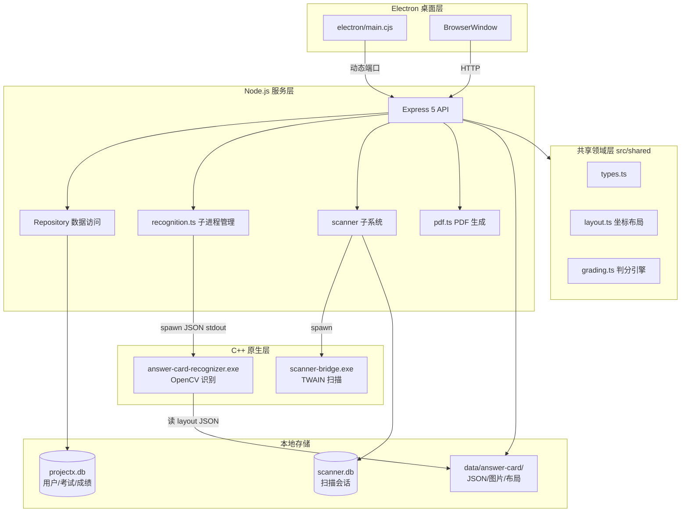
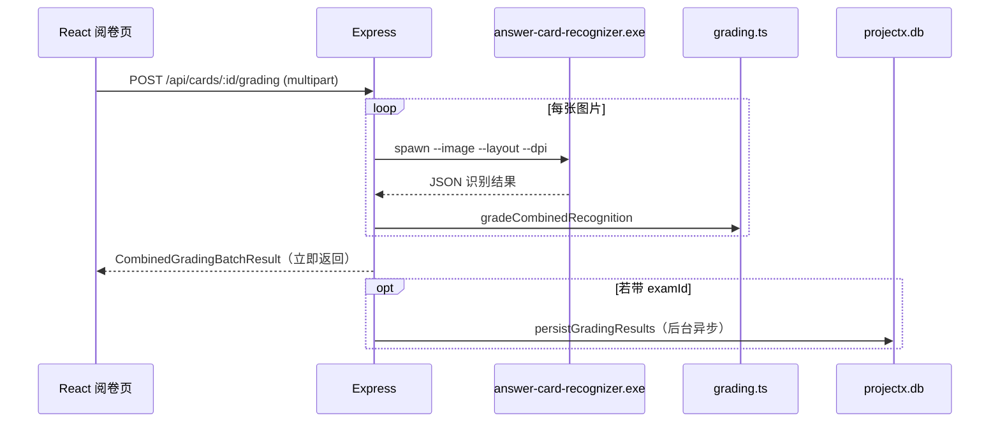
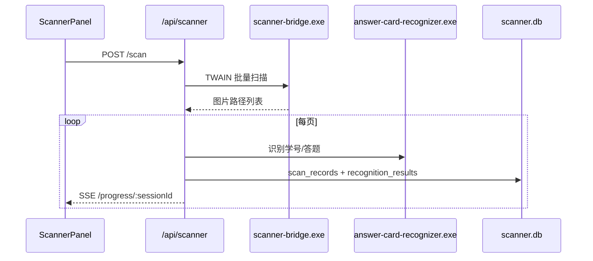
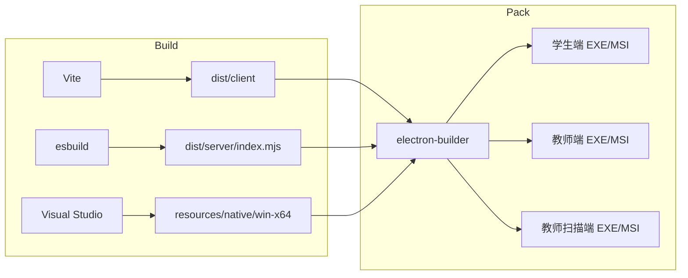

# Project-X 架构分析

**Project-X（答题卡设计系统）** 是大连五中自研的本地优先智能试卷管理工具，覆盖 **答题卡设计 → PDF 导出 → 扫描/上传识别 → 自动判分 → 成绩分析** 全流程。架构上是 **Electron 桌面壳 + 内嵌 Express 后端 + React 前端 + C++ 原生子进程** 的组合。

---

## 1. 总体架构

系统采用 **单体本地应用** 模式：Electron 启动后在本机拉起 Node 服务，浏览器窗口加载同一进程内的静态前端，所有数据与识别均在本地完成。



**运行模式对比：**

| 模式 | 前端 | 后端 | 数据目录 |
|------|------|------|----------|
| 开发 `npm run dev` | Vite :5173（代理 `/api`） | tsx :5174 | 项目根 `data/` |
| 生产 / Electron | `dist/client` 静态资源 | `dist/server/index.mjs` | `%AppData%/.../userData/data/` |

Electron 主进程通过环境变量注入路径：

```javascript
// electron/main.cjs
async function startLocalServer() {
  const appRoot = getAppRoot();
  const serverBundle = path.join(appRoot, "dist", "server", "index.mjs");
  const clientDist = path.join(appRoot, "dist", "client");
  const userDataDir = app.getPath("userData");
  const dataDir = path.join(userDataDir, "data", "answer-card");

  process.env.ANSWER_CARD_DATA_DIR = dataDir;
  process.env.ANSWER_CARD_CLIENT_DIST = clientDist;
  process.env.PROJECTX_DB_PATH = path.join(userDataDir, "data", "projectx.db");
  // ...
}
```

---

## 2. 源码分层

```
src/
├── apps/answer-card/     ← 当前唯一业务应用（答题卡）
│   ├── client/           ← React UI（设计 / 阅卷 / 分析）
│   └── server/           ← Express 路由 + 识别/PDF/扫描
├── server/               ← 跨应用共享后端（DB、Repository、Auth）
└── shared/               ← 前后端共享领域逻辑（类型、布局、判分）
native/                   ← C++ 识别引擎 + TWAIN 桥
electron/                 ← 桌面打包入口
```

这是 **按应用划分 + 共享内核** 的结构：`apps/answer-card` 是具体产品，`server/` 和 `shared/` 为后续扩展（如 v1.1 权限、多班级）预留。

---

## 3. 前端架构

前端是 **单页应用（SPA）**，核心在 `App.tsx`，通过 `AppMode` 切换五种工作模式：

```typescript
type AppMode = "design" | "grading" | "analysis" | "scores" | "account";
```

| 模式 | 职责 | 主要组件 |
|------|------|----------|
| **design** | 编辑答题卡、预览、导出 PDF | 内联编辑器 + `buildLayout` 预览 |
| **grading** | 上传/扫描图片、批量识别判分 | `ScannerPanel`、`GradingResults` |
| **analysis** | 考试统计、排名、题目分析 | `AnalysisOverview`、`AnalysisDistribution`、`AnalysisRanking`、`AnalysisQuestions` |
| **scores** | 学生查看个人成绩 | `StudentScores` |
| **account** | 教师/学生管理 | `AccountManagement`、`TeacherManagement`、`ClassManagement` |

**特点：**

- 无 Redux/Zustand，用 React `useState` + `fetch` 直连 REST API
- 图标：`lucide-react`
- 样式：单一 `styles.css`，无 UI 框架
- 与后端通信：`fetchJson` 封装，开发时 Vite 代理到 5174

---

## 4. 后端架构

### 4.1 Express 单体路由

入口 `src/apps/answer-card/server/index.ts` 的 `createApp()` 负责：

1. 初始化 `projectx.db`、默认管理员、定时清理
2. 挂载 REST 路由
3. 生产环境托管 `dist/client`（SPA fallback）

**API 域划分：**

| 前缀 | 功能 |
|------|------|
| `/api/auth` | 登录 / 登出 / 当前用户 |
| `/api/cards` | 答题卡 CRUD、布局、PDF、识别、判分 |
| `/api/exams` | 考试管理 |
| `/api/analysis` | 成绩统计与排名 |
| `/api/scanner` | TWAIN 扫描会话（SSE 进度） |
| `/assets` | 答题卡资源图片 |

### 4.2 Repository 模式

`src/server/repositories/` 封装 SQLite 访问：

- `CardRepository` — 答题卡及题块元数据
- `ExamRepository` — 考试、扫描批次、成绩落库
- `AnalysisRepository` — 聚合统计查询
- `UserRepository` — 用户与角色

数据库连接在 `src/server/db/index.ts`，使用 **better-sqlite3 同步 API + WAL + 外键**。

### 4.3 双数据库设计

| 数据库 | 路径 | 用途 |
|--------|------|------|
| **projectx.db** | `PROJECTX_DB_PATH` | 用户、角色、答题卡、考试、成绩、班级 |
| **scanner.db** | `data/answer-card/scanner.db` | 扫描会话、逐页记录、识别结果快照 |

扫描子系统独立库，与主库解耦，便于扫描流水单独保留/清理（主库 schema 注释：扫描原始数据保留 30 天）。

### 4.4 文件存储层

`storage.ts` 定义运行时文件布局：

```
data/answer-card/
├── cards/          # 答题卡 JSON（历史/兼容，主数据已进 DB）
├── layouts/        # LayoutDocument JSON（供 C++ 识别引擎读取）
├── assets/         # 主观题插图等资源
├── scans/          # 扫描仪直扫图片
├── recognition/    # 阅卷上传的临时图片
└── scanner.db
```

答题卡保存时会 **同时写 DB + 布局 JSON 文件**，识别引擎只读 JSON 布局文件路径。

---

## 5. 共享领域层（核心设计）

`src/shared/` 是前后端共用的 **领域模型与算法**，避免判分/布局逻辑重复。

### 5.1 类型系统 (`types.ts`)

定义完整领域模型：

- `AnswerCard` / `BodyBlock`（客观题、主观题）
- `LayoutDocument`（毫米级坐标）
- 识别结果、判分结果、分析统计等 DTO

### 5.2 布局引擎 (`layout.ts`)

纯函数 `buildLayout(card)`：

- A4 210×297mm 坐标系
- 六点定位标记、学号填涂格、客观选项框、主观书写区
- 密度档位（loose/normal/compact/dense）
- 输出供 **PDF 渲染** 和 **C++ 识别** 共用

### 5.3 判分引擎 (`grading.ts`)

TypeScript 实现，在 Node 侧运行：

- `gradeObjectiveRecognition` — 客观题对比标准答案（单选/多选/不定项、部分分）
- `gradeCombinedRecognition` — 客观 + 主观（红色分数格识别结果）
- 低置信度阈值 `OBJECTIVE_REVIEW_CONFIDENCE_THRESHOLD = 0.12`，标记「待复核」

**职责分离：** C++ 只做 **图像 → 填涂/分数识别**；TS 做 **业务判分规则**。

---

## 6. 识别与扫描流水线

### 6.1 阅卷判分流程



`recognition.ts` 通过 **子进程 + stdout JSON** 调用原生引擎，30 秒超时，支持 debug 目录输出。

### 6.2 扫描仪流程



扫描进度通过 **Server-Sent Events (SSE)** 推送，前端实时显示缩略图与状态。

---

## 7. C++ 原生层

| 模块 | 路径 | 技术 | 职责 |
|------|------|------|------|
| **AnswerCardRecognizer** | `native/AnswerCardRecognizer/` | OpenCV 4.13 + nlohmann/json | 定位校正、填涂检测、学号格、主观红笔分数格 |
| **ScannerBridge** | `native/ScannerBridge/` | TWAIN + GDI+ | 驱动扫描仪（如柯达 i3000） |

打包时复制到 `resources/native/win-x64/`，Electron 通过 `extraResources` 内嵌；Node 侧按多路径候选解析 exe 位置。

**集成方式：** 无 Node-API 绑定，全部采用 **CLI 子进程**，降低 Electron/Node 版本与原生模块的耦合，但增加进程启动开销。

---

## 8. 认证与安全（部分就绪）

已有模块：

- `AuthService` + bcrypt 密码哈希
- `roles` / `users` 表与默认 admin
- `/api/auth/login`、`Bearer token` 中间件

v1.1 中所有用户强制登录，具有基于角色的 UI（管理员/教师/学生），以及完整的用户权限管理和班级分析功能。

---

## 9. 构建与部署



- **前端：** Vite → `dist/client`
- **后端：** esbuild 单文件 bundle（`packages: external`，保留 better-sqlite3/bcrypt 等原生依赖）→ `dist/server/index.mjs`，并复制 `schema.sql`
- **桌面：** electron-builder，Windows x64，三端变体（学生/教师/扫描），按端裁剪 native 资源，共用数据目录
- **原生 Node 模块：** 需对 Electron 单独 `electron-rebuild`（better-sqlite3、bcrypt）

---

## 10. 架构特点与权衡

**优点：**

1. **本地可控** — 数据、识别、扫描均在机房/教师机本地，符合学校隐私与自主诉求
2. **领域集中** — `shared/` 统一布局与判分，PDF 与识别坐标一致
3. **清晰分层** — Repository + 子进程边界明确
4. **渐进扩展** — `apps/` 多应用、`server/` 共享模块便于 v1.1 权限与分析增强

**权衡 / 注意点：**

1. **Windows 绑定** — TWAIN、Electron 打包、C++ 均为 Win-x64 导向
2. **双存储** — 答题卡既在 SQLite 又在 `layouts/` JSON，需保持一致（保存路径已统一在 `saveCardWithLayout`）
3. **单体 Express** — 路由集中在 `index.ts`（700+ 行），随功能增长可考虑按域拆 router
4. **子进程识别** — 简单可靠，但高并发批量阅卷时进程开销明显
5. **Auth 完全贯通** — v1.1 具备登录门禁、角色化 UI 和基于权限的 API 访问

---

## 11. 核心业务数据流（一图总结）

```
[设计模式]
  用户编辑 AnswerCard
    → buildLayout() 生成 LayoutDocument
    → CardRepository + layouts/*.json
    → pdfkit 导出 A4 PDF

[阅卷模式]
  图片上传 / 扫描
    → C++ 识别 JSON
    → grading.ts 判分
    → 可选 examId → ExamRepository 落库
    → CSV 导出

[分析模式]
  选择考试
    → AnalysisRepository 聚合
    → 总览 / 分布图 / 排名 / 题目得分率
```

---

## 12. 技术栈速查

| 层级 | 技术 |
|------|------|
| **前端** | React 19 + TypeScript + Vite + Lucide React |
| **后端** | Node.js + Express 5 + multer |
| **识别引擎** | C++ + OpenCV 4.13 + nlohmann/json（子进程调用） |
| **扫描仪** | C++ TWAIN API + GDI+（子进程调用） |
| **数据库** | SQLite via better-sqlite3（WAL + 外键约束） |
| **PDF** | pdfkit（毫米级精确排版） |
| **桌面** | Electron 39 + electron-builder + WiX Toolset |
| **构建** | Vite（前端）+ esbuild（后端） |

---

> 文档生成日期：2026-06-13  
> 基于 Project-X v1.1.0 代码库分析
