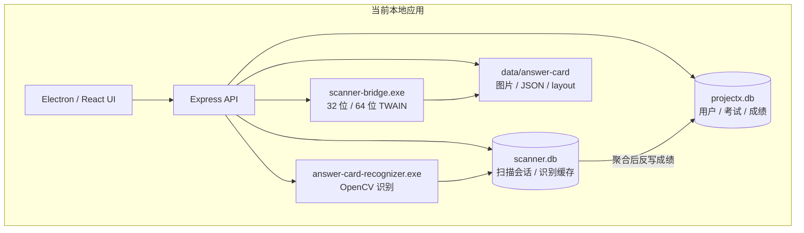
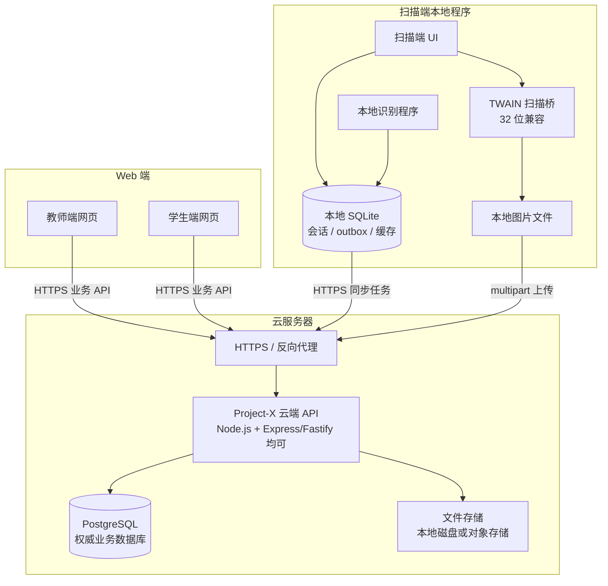
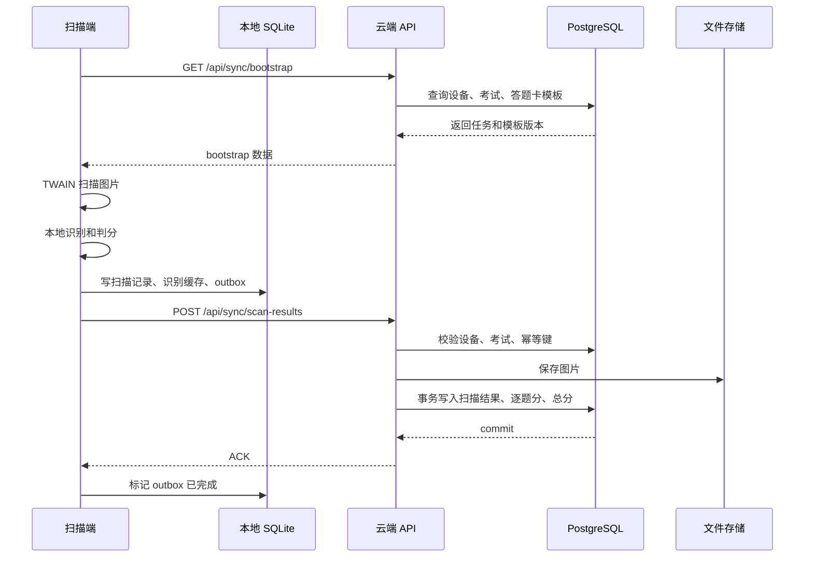

# Project-X 云端数据库与多端重构方案

> 阶段目标：先把数据库权威边界、扫描端同步方式、未来教师端/学生端 Web 化路径写清楚。本文档不代表已经完成代码改造，也不要求立即迁移现有 SQLite 数据。

## 1. 目标结论

Project-X 后续云端化建议采用 **自建 PostgreSQL 作为云端权威数据库，本地继续使用 SQLite 作为端侧缓存** 的架构。

- 云端：PostgreSQL 保存用户、班级、答题卡、考试、成绩、设备、同步事件、文件元数据，是最终权威数据源。
- 教师端：未来改为网页端，通过 HTTPS 访问云端业务 API，不直接访问本机 SQLite。
- 学生端：未来改为网页端，通过 HTTPS 查询云端成绩与个人分析数据。
- 扫描端：继续保留 Windows 本地程序和 TWAIN/识别能力，必须强兼容 32 位系统；本地 SQLite 只保存扫描会话、图片索引、识别缓存、待上传队列和上传状态。
- 图片：不直接塞入数据库。扫描端通过 HTTPS multipart 上传图片，云端保存文件路径、对象存储 key、哈希和识别元数据。

云端数据库推荐 PostgreSQL 的原因：

- PostgreSQL 是开源免费的对象关系数据库，适合自建在云服务器上。
- PostgreSQL 支持 MVCC、事务隔离、WAL、复制、外键、JSON/JSONB、丰富索引和多用户并发。
- PostgreSQL 官方文档明确说明 MVCC 让读写互不阻塞，适合未来教师端、学生端和扫描端同时访问的场景。

参考资料：

- [PostgreSQL About](https://www.postgresql.org/about/)
- [PostgreSQL MVCC](https://www.postgresql.org/docs/current/mvcc-intro.html)
- [node-postgres](https://node-postgres.com/)

## 2. 当前现状

当前系统是本地优先的 Electron + Express + React 应用，数据访问还没有为云端权威模型做好边界隔离。

### 2.1 当前数据层

- 主数据库：`projectx.db`
  - 用户、角色、班级、答题卡、考试、扫描批次、扫描记录、学生总分、逐题得分、AI 服务商配置等。
  - 当前由 `src/server/db/index.ts` 初始化，仓储和部分 route/service 直接通过 `getDatabase()` 访问。
- 扫描本地数据：`scanner.db` 风格的数据访问层
  - 扫描会话、扫描页、识别结果、按学生聚合后的扫描结果。
  - 当前由 `src/apps/answer-card/server/database/*` 管理。
- 文件层：`data/answer-card/...`
  - 答题卡 JSON、布局 JSON、资源图片、扫描上传图片、识别调试文件等。
- 混合格式：
  - 关系表保存结构化数据。
  - `layout_data`、题目答案、识别结果等字段保存 JSON 字符串。
  - 图片和资源以文件路径引用。

### 2.2 当前耦合点

当前最需要解耦的是“扫描端结果如何进入正式成绩”的路径。



这个结构在单机版可用，但云端化后会遇到几个问题：

- 扫描端本地直接写主成绩库的假设不再成立。
- 教师端、学生端 Web 化后不能再依赖扫描机器上的 SQLite。
- 多台扫描端同时上传时，需要云端做幂等、事务、权限和冲突处理。
- 图片文件、识别 JSON、正式成绩之间需要明确生命周期和清理策略。

## 3. 目标架构

目标架构采用“云端权威 + 本地缓存 + HTTPS 同步”的模型。



### 3.1 云端权威数据

以下数据以云端 PostgreSQL 为准：

- 学校、年级、班级、学生、教师、角色和权限。
- 答题卡模板、题块、题目、标准答案、评分规则。
- 考试、考试任务、考试状态。
- 扫描设备注册信息、设备授权范围、设备上传批次。
- 学生总分、逐题得分、手动改分记录、复核状态。
- AI 分析配置和云端分析结果。

### 3.2 本地缓存数据

以下数据只属于扫描端本机缓存：

- 本机设备配置、扫描仪来源、DPI、单双面、色彩模式。
- 本机扫描会话和页记录。
- 本机图片路径、文件哈希、页码、正反面信息。
- 本机识别结果缓存。
- 上传 outbox、重试次数、最后错误、云端 ACK 状态。

本地 SQLite 可以丢失后重新从云端拉取任务，但未上传图片和未上传识别结果需要通过 outbox 保护。

### 3.3 扫描端兼容原则

扫描端运行环境是 32 位系统时，必须满足：

- 不要求本机安装 PostgreSQL 客户端。
- 不要求本机加载 PostgreSQL 原生驱动。
- 不要求扫描端直连数据库端口。
- 只要求具备本地 SQLite、文件读写、HTTPS multipart 上传能力。
- 所有云端写入都通过稳定 API 完成。

## 4. 云端数据库建议

### 4.1 PostgreSQL 版本

生产建议使用 PostgreSQL 稳定正式版。当前本机已经安装 PostgreSQL 18：

- Windows 服务：`postgresql-x64-18`
- 服务状态：已确认正在运行。
- `psql.exe` 路径：`C:\Program Files\PostgreSQL\18\bin\psql.exe`
- 注意：`psql` 当前未加入 PATH，执行命令时应使用完整路径或把 `bin` 目录临时加入 PATH。

### 4.2 Node 访问方式

第一阶段建议使用 `pg`：

- 驱动成熟，支持连接池。
- 纯业务 API 层容易控制 SQL、事务和错误处理。
- 不把本地 SQLite 重构一次性绑死在某个 ORM 上。

后续当 schema 稳定后，可以再评估是否引入 Drizzle、Prisma 或迁移工具。第一阶段重点是边界清晰，不是追求抽象漂亮。

### 4.3 连接配置

不要把 PostgreSQL 密码或完整连接串写入仓库。建议使用环境变量：

```powershell
$env:PROJECTX_PGHOST = "127.0.0.1"
$env:PROJECTX_PGPORT = "5432"
$env:PROJECTX_PGDATABASE = "projectx_cloud_test"
$env:PROJECTX_PGUSER = "postgres"
$env:PROJECTX_PGPASSWORD = "<本机临时密码>"
```

云端部署时再改为服务器环境变量或机密管理配置。

## 5. 同步接口草案

### 5.1 扫描端启动拉取

`GET /api/sync/bootstrap`

用途：扫描端启动后拉取本设备可见的任务、答题卡模板和同步配置。

请求头：

```http
Authorization: Bearer <device-or-user-token>
```

响应示例：

```json
{
  "serverTime": "2026-06-20T12:00:00.000Z",
  "device": {
    "id": "scanner-001",
    "schoolId": "dl5z",
    "enabled": true
  },
  "tasks": [
    {
      "examId": 101,
      "cardId": "1781332381176",
      "name": "高一物理周测",
      "status": "active"
    }
  ],
  "cards": [
    {
      "cardId": "1781332381176",
      "version": 7,
      "layoutHash": "sha256:..."
    }
  ]
}
```

### 5.2 上传扫描和识别结果

`POST /api/sync/scan-results`

用途：扫描端上传图片、识别 JSON、判分结果和本地幂等键。

建议格式：`multipart/form-data`

- `metadata`：JSON 字符串。
- `images[]`：图片文件，一个学生可多页。

`metadata` 示例：

```json
{
  "idempotencyKey": "scanner-001:session-abc:student-20260001:v1",
  "deviceId": "scanner-001",
  "localSessionId": "session-abc",
  "examId": 101,
  "cardId": "1781332381176",
  "studentNumber": "20260001",
  "pages": [
    {
      "localRecordId": "page-1",
      "pageNum": 1,
      "side": "front",
      "fileName": "20260001-front.jpg",
      "sha256": "..."
    }
  ],
  "recognition": {
    "studentConfidence": 0.98,
    "objectiveQuestions": [],
    "subjectiveQuestions": [],
    "needsReviewCount": 0
  },
  "scores": {
    "objectiveScore": 42,
    "subjectiveScore": 18,
    "totalScore": 60,
    "maxScore": 70
  }
}
```

云端处理要求：

- 按 `idempotencyKey` 做幂等，重复上传不重复入库。
- 图片先落文件存储，再在 PostgreSQL 中写文件元数据。
- 识别结果、逐题得分、学生总分必须在同一个事务内写入。
- 学生不存在时可进入待复核状态，不应丢弃原始图片和识别结果。
- 入库失败时返回可重试错误码和原因，扫描端保留 outbox。

响应示例：

```json
{
  "accepted": true,
  "cloudBatchId": 501,
  "cloudScanResultId": 9001,
  "status": "stored",
  "message": "uploaded"
}
```

### 5.3 查询同步状态

`GET /api/sync/status?deviceId=scanner-001&localSessionId=session-abc`

用途：扫描端查询某个本地会话的云端入库状态，恢复中断上传。

响应示例：

```json
{
  "localSessionId": "session-abc",
  "items": [
    {
      "idempotencyKey": "scanner-001:session-abc:student-20260001:v1",
      "status": "stored",
      "cloudScanResultId": 9001,
      "lastError": null
    }
  ]
}
```

## 6. 扫描上传时序



## 7. 本机 PostgreSQL 18 验证路线

本机已经具备 PostgreSQL 18，可用于后续 smoke 测试。第一阶段文档不执行测试库创建；真正验证时建议只创建测试库和测试表，不碰现有 SQLite 和正式数据。

### 7.1 检查服务

```powershell
Get-Service postgresql-x64-18
```

### 7.2 使用完整路径运行 psql

```powershell
& "C:\Program Files\PostgreSQL\18\bin\psql.exe" --version
```

如果要临时进入测试库，建议用环境变量传递连接信息，避免把密码写入命令历史或仓库文件。

### 7.3 测试库建议

建议测试库名：

```text
projectx_cloud_test
```

建议先建最小 smoke 表：

```sql
CREATE TABLE IF NOT EXISTS cloud_smoke_events (
  id BIGSERIAL PRIMARY KEY,
  source TEXT NOT NULL,
  payload JSONB NOT NULL,
  created_at TIMESTAMPTZ NOT NULL DEFAULT now()
);
```

测试目标：

- Node 进程能通过 `pg` 连接池连接 PostgreSQL。
- 能插入一条 JSONB 事件。
- 能读回刚才插入的数据。
- 错误时不泄露数据库密码。

## 8. 代码改造路线

本文档阶段不改代码。后续实现建议按以下顺序推进。

### Phase 1：文档和边界确认

- 明确云端权威、本地缓存、文件存储、同步接口。
- 明确扫描端只走 HTTPS，不直连 PostgreSQL。
- 明确 PostgreSQL 本机测试方式。

### Phase 2：收口数据访问

- 把散落的 `getDatabase()` 直接调用收口到仓储或服务接口。
- 优先处理这些热点：
  - `src/server/db/index.ts`
  - `src/server/repositories/*`
  - `src/server/routes/*` 中直接 SQL 调用
  - `src/apps/answer-card/server/database/*`
  - `src/apps/answer-card/server/scanner/index.ts` 中扫描结果反写主库逻辑
- 给答题卡、考试、成绩、扫描结果定义稳定领域接口。

### Phase 3：双数据库适配

- 本地适配器：SQLite，继续服务桌面/扫描端缓存。
- 云端适配器：PostgreSQL，服务教师/学生 Web 和云端 API。
- 业务层尽量面向接口，不直接依赖 `better-sqlite3` 或 `pg` 的具体返回结构。

### Phase 4：扫描端 outbox 同步

- 本地新增 outbox 表，记录待上传任务。
- 支持断点续传、幂等重试、失败原因、手动重传。
- 上传成功后只标记本地状态，不再把本地缓存当作最终成绩库。

### Phase 5：教师端/学生端 Web 化

- 教师端页面使用云端 API 读写答题卡、考试、成绩和分析。
- 学生端页面使用云端 API 查询个人成绩。
- 扫描端保留 Electron 或独立本地程序形态，继续服务扫描硬件。

## 9. 验收清单

- 文档包含当前现状图。
- 文档包含目标云端架构图。
- 文档包含扫描上传时序图。
- 文档明确云端权威数据和本地缓存数据。
- 文档明确扫描端 32 位兼容原则。
- 文档包含 `GET /api/sync/bootstrap`、`POST /api/sync/scan-results`、`GET /api/sync/status` 草案。
- 文档包含本机 PostgreSQL 18 验证路线。
- 文档不包含 PostgreSQL 密码、真实连接串或生产密钥。

